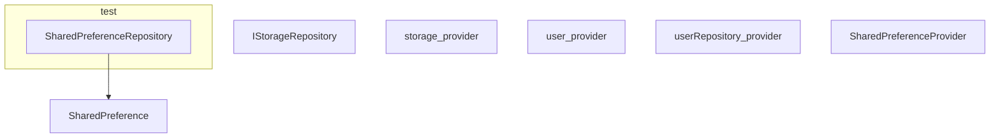

```mermaid
graph TB
    sp[SharedPreference]
    spr[SharedPreferenceRepository]
    istorage[IStorageRepository]
    

    st_p[storage_provider]
    user_p[user_provider]
    userRepo_p[userRepository_provider]
    sp_p[SharedPreferenceProvider]

    spr --> sp

  
    subgraph test
        spr
    end 


```

